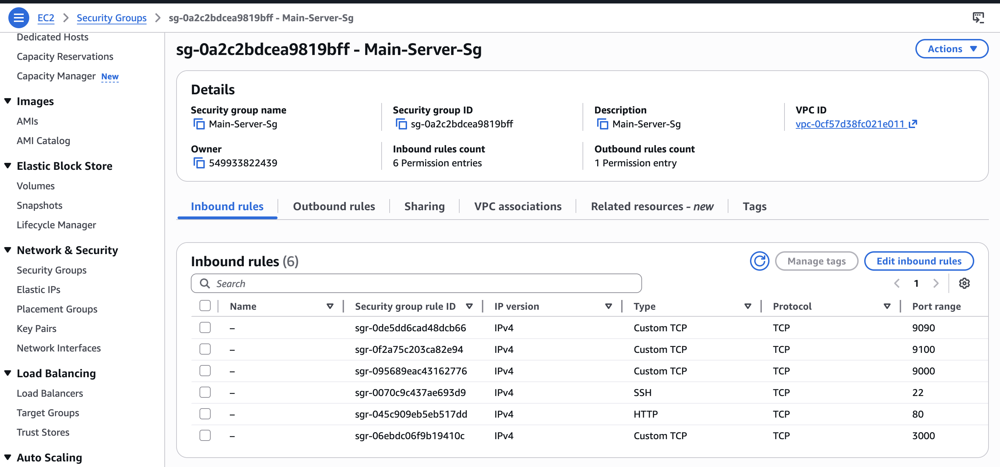
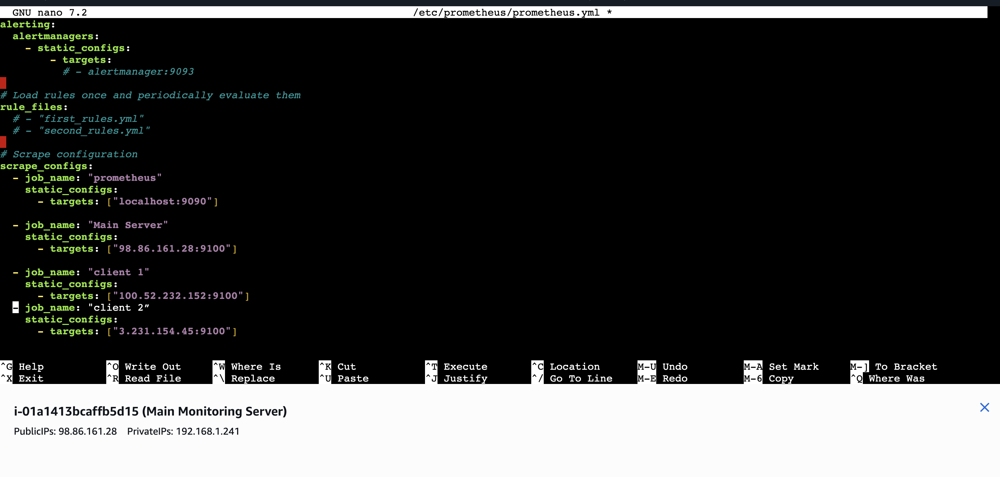
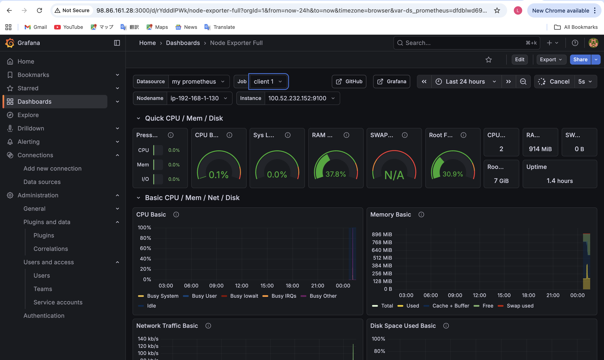
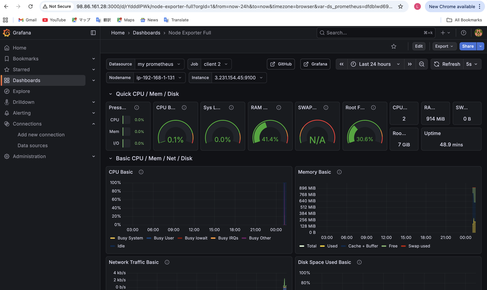
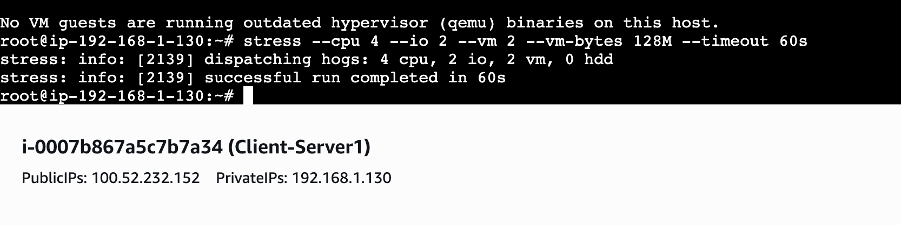
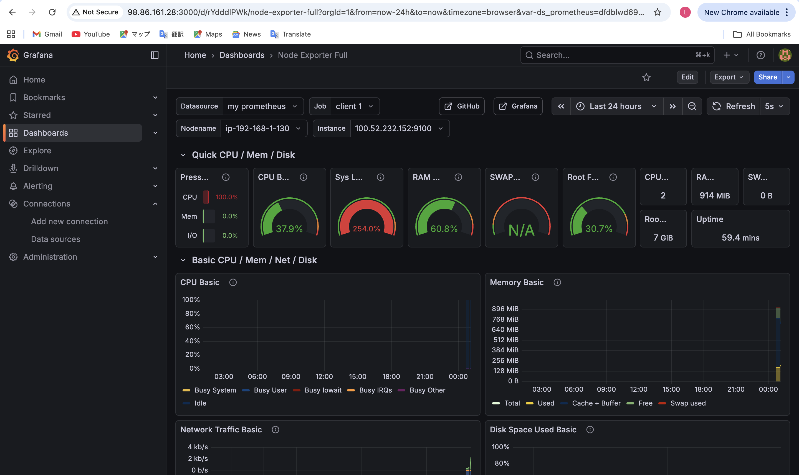

# AWS Multi-node Infrastructure Monitoring System

**Real-time Infrastructure Monitoring and Stress Analysis with Prometheus and Grafana.**

**Scenario:** To maintain high availability and performance visibility across a distributed server network, I implemented a centralized monitoring system on AWS EC2. This project demonstrates how to collect metrics from multiple remote nodes and analyze system behavior under high-load conditions using Grafana dashboards.

**シナリオ:** 分散されたサーバーネットワーク全体で高可用性とパフォーマンスの可視性を維持するために、AWS EC2上に集中監視システムを実装しました。このプロジェクトでは、複数のリモートノードからメトリクスを収集し、Grafanaダッシュボードを使用して高負荷条件下でのシステム動作を分析する方法を実証しています。

---

# **Project Architecture / プロジェクト構成図**

This setup monitors three EC2 instances (Main Server and two Client Nodes) using Prometheus as the time-series database and Grafana for professional data visualization.

このセットアップでは、時系列データベースとしてPrometheusを、プロフェッショナルなデータ可視化のためにGrafanaを使用して、3つのEC2インスタンス（メインサーバーと2つのクライアントノード）を監視します。

---

# **Key Components / 主な構成要素**

* **Prometheus Server:** Central hub for metric scraping and storage (Port 9090).
* **Grafana Dashboard:** Visual interface for real-time monitoring and alerting (Port 3000).
* **Node Exporter:** Installed on all targets to export hardware and OS metrics (Port 9100).
* **AWS Security Groups:** Configured to allow secure inter-node communication.

---

# **Implementation Steps / 実装手順**

<b>Click here to view Step-by-Step Configuration & Results / ステップごとの設定と結果を表示するにはここをクリック</b>

| Step / ステップ | Description / 説明 | Screenshot / スクリーンショット |
|:---:|---|:---:|
| **1. Security Group** | Configured firewall rules for monitoring ports (9090, 9100, 3000). / 監視ポートのファイアウォールルールを構成しました。 |  |
| **2. Multi-node Config** | Defined scrape targets for the main server and remote clients in `prometheus.yml`. / `prometheus.yml`でメインサーバーとリモートクライアントの監視ターゲットを定義しました。 |  |
| **3. Target Verification** | Confirmed that all 3 nodes are "UP" and successfully connected to Prometheus. / 3つのノードすべてが「UP」であり、Prometheusに正常に接続されていることを確認しました。 |  |
| **4. Main Server Health** | Visualized real-time CPU and Memory metrics for the Main Monitoring Server. / メイン監視サーバーのリアルタイムのCPUとメモリメトリクスを可視化しました。 |  |
| **5. Client Node 1** | Verified data collection from the first remote client instance. / 最初のリモートクライアントインスタンスからのデータ収集を確認しました。 |  |
| **6. Client Node 2** | Monitored the second client node to ensure multi-node coverage. / マルチノードの範囲を確認するために、2番目のクライアントノードを監視しました。 |  |
| **7. Stress Test Execution** | Performed artificial load injection using the Linux `stress` tool. / Linuxの`stress`ツールを使用して、人工的な負荷注入を実行しました。 |  |
| **8. Load Analysis** | Analyzed the system bottleneck as CPU load reached 100% during the stress test. / ストレステスト中にCPU負荷が100%に達した際のシステムボトルネックを分析しました。 |  |

---

# **Technical Insights / 技術解説**

* **Distributed Monitoring:** Implementing a multi-node architecture allows for a "Single Pane of Glass" view, monitoring the health of the entire infrastructure from one dashboard.

* **分散型監視:** マルチノードアーキテクチャを実装することで、「シングルペインオブグラス」ビューが可能になり、1つのダッシュボードからインフラストラクチャ全体の健全性を監視できます。

* **Proactive Analysis:** By utilizing stress testing, we can simulate traffic spikes and identify resource limits before they impact production performance.

* **プロアクティブな分析:** ストレステストを利用することで、トラフィックスパイクをシミュレートし、本番のパフォーマンスに影響を与える前にリソース制限を特定できます。

---

# **Tech Stack / 使用技術**

* **AWS Services:** EC2 (Ubuntu 24.04), VPC, Security Groups
* **Monitoring Stack:** Prometheus, Grafana, Node Exporter
* **Testing Tools:** Linux Stress Tool
* **Protocols:** TCP/IP, HTTP (Ports 9090, 3000, 9100)
